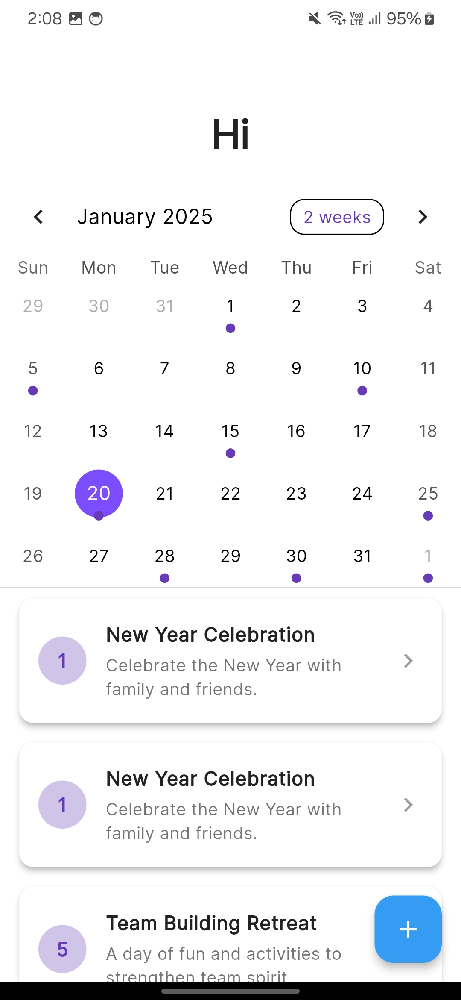
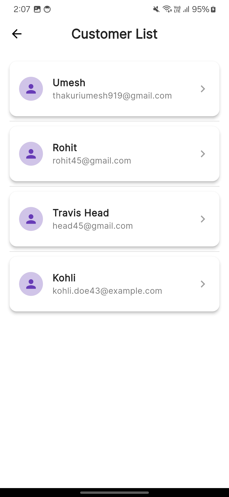
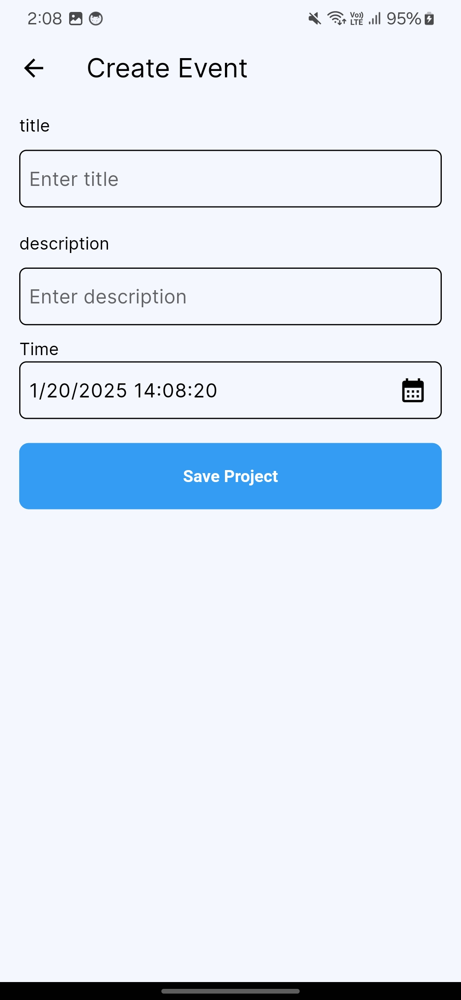
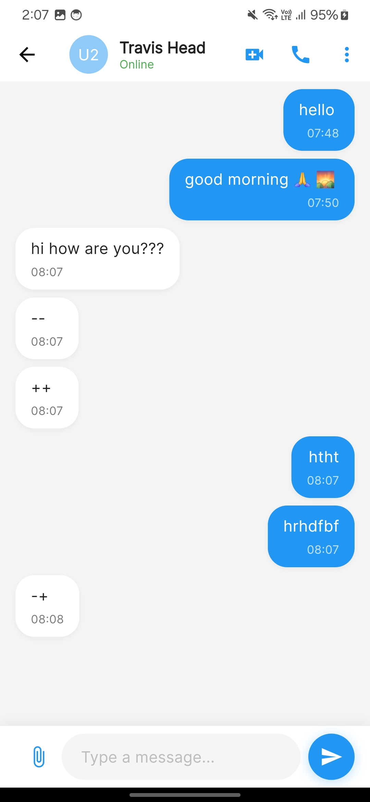
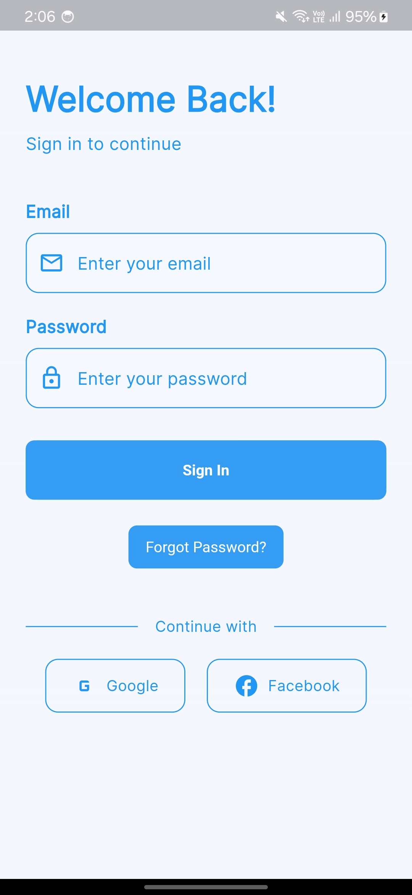

# Chat & Events Application

A full-stack real-time messaging and events management application built with Flutter and Node.js. Users can authenticate, send real-time messages, create events, and manage event responses.

## Features

### Authentication
- Email and password-based authentication
- JWT token-based session management
- Secure password hashing
- Password recovery functionality

### Real-time Messaging
- One-on-one messaging
- Real-time message delivery using Socket.IO
- Message status indicators (sent, delivered, read)
- Message history
- Online/offline status

### Events Management
- Create and publish events
- Event details including title, description, date, time, and location
- RSVP functionality (Going, Maybe, Not Going)
- Event reminders
- View all events with filtering options

## Tech Stack

### Frontend (Flutter)
- Flutter SDK
- GetX for state management
- Socket.IO client for real-time communication
- Shared preferences for local storage
- Flutter Form Builder for forms
- Intl package for date formatting

### Backend (Node.js)
- Express.js framework
- MongoDB for database
- Mongoose ODM
- Socket.IO for real-time communication
- JWT for authentication
- Bcrypt for password hashing
- Nodemailer for email notifications

### UI of the app 








## Project Setup

### Prerequisites
- Flutter SDK (3.0 or higher)
- Node.js (14.0 or higher)
- MongoDB
- Git

### Backend Setup

1. Clone the repository
```bash
git clone <repository-url>
cd backend
```

2. Install dependencies
```bash
npm install
```

3. Create a .env file in the backend directory
```env
PORT=3000
MONGODB_URI=mongodb://localhost:27017/chat_events_db
JWT_SECRET=your_jwt_secret_key
SMTP_HOST=your_smtp_host
SMTP_USER=your_smtp_user
SMTP_PASS=your_smtp_password
```

4. Start the server
```bash
npm run dev
```

### Frontend Setup

1. Navigate to the Flutter project directory
```bash
cd frontend
```

2. Install Flutter dependencies
```bash
flutter pub get
```

3. Update the API configuration in `lib/config/api_config.dart`
```dart
class ApiConfig {
  static const String baseUrl = 'http://your-backend-url:3000';
  static const String socketUrl = 'http://your-backend-url:3000';
}
```

4. Run the application
```bash
flutter run
```

## API Endpoints

### Authentication
- `POST /api/auth/register` - Register new user
- `POST /api/auth/login` - User login
- `POST /api/auth/forgot-password` - Password recovery

### Messages
- `GET /api/messages/:userId` - Get message history
- `POST /api/messages` - Send new message
- `PUT /api/messages/:messageId/read` - Mark message as read

### Events
- `GET /api/events` - Get all events
- `POST /api/events` - Create new event
- `PUT /api/events/:eventId/response` - Update event response
- `GET /api/events/:eventId` - Get event details

## Socket Events

### Client Events
- `join` - Join user's room
- `message` - Send new message
- `typing` - User typing indicator
- `read` - Message read receipt

### Server Events
- `message` - Receive new message
- `typing` - Receive typing indicator
- `userStatus` - User online/offline status
- `eventUpdate` - Real-time event updates

## Database Schema

### User Collection
```javascript
{
  email: String,
  password: String,
  name: String,
  avatar: String,
  createdAt: Date
}
```

### Message Collection
```javascript
{
  sender: ObjectId,
  recipient: ObjectId,
  content: String,
  status: String,
  createdAt: Date
}
```

### Event Collection
```javascript
{
  creator: ObjectId,
  title: String,
  description: String,
  dateTime: Date,
  location: String,
  responses: [{
    user: ObjectId,
    status: String,
    updatedAt: Date
  }],
  createdAt: Date
}
```

## Contributing

1. Fork the repository
2. Create your feature branch (`git checkout -b feature/amazing-feature`)
3. Commit your changes (`git commit -m 'Add some amazing feature'`)
4. Push to the branch (`git push origin feature/amazing-feature`)
5. Open a Pull Request

## Testing

### Backend Tests
```bash
npm test
```

### Flutter Tests
```bash
flutter test
```

## Deployment

### Backend Deployment
1. Set up your production environment variables
2. Build the application: `npm run build`
3. Start the server: `npm start`

### Flutter Deployment
1. Update the API configuration for production
2. Build for Android: `flutter build apk`
3. Build for iOS: `flutter build ios`

## License

This project is licensed under the MIT License - see the [LICENSE.md](LICENSE.md) file for details

## Support

For support, email thakuriumesh919@gmail.com or create an issue in the repository.

## Acknowledgments

- Flutter team for the amazing framework
- Socket.IO team for real-time capabilities
- All contributors who have helped with the project